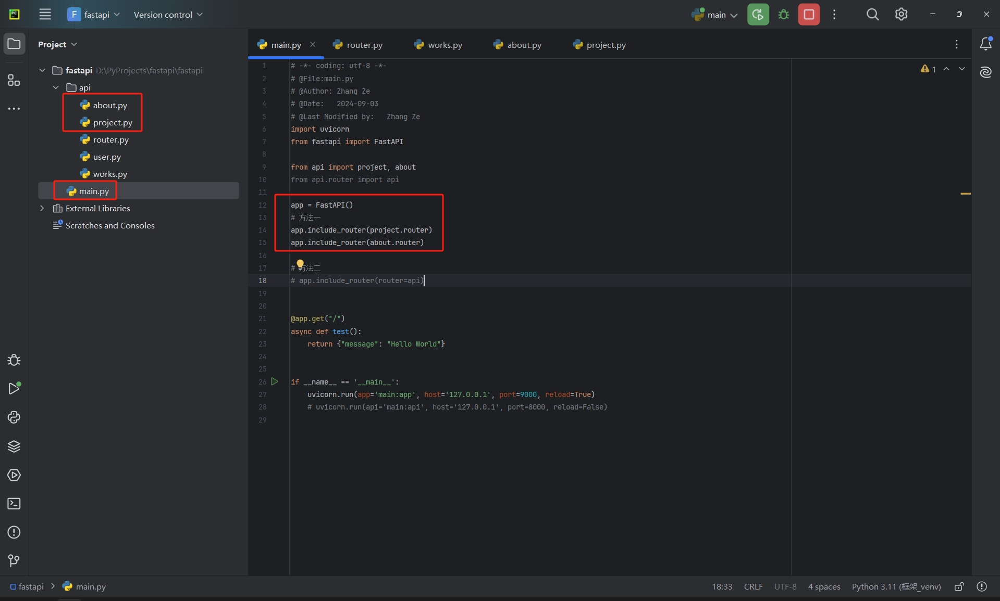
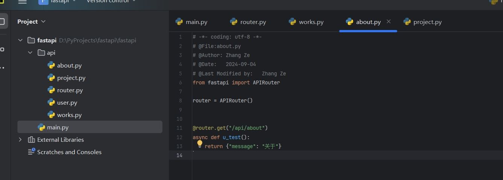
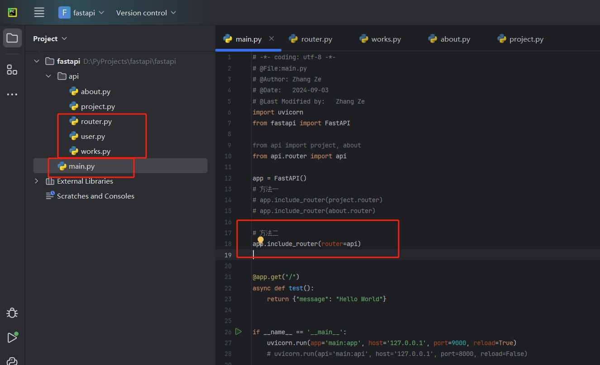
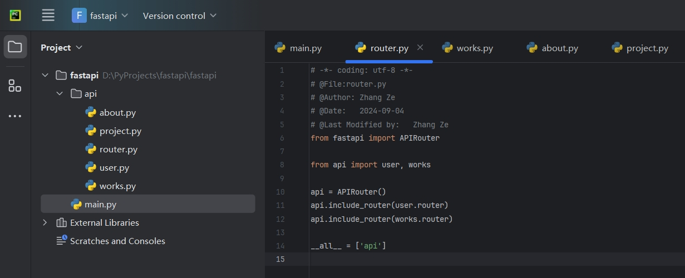
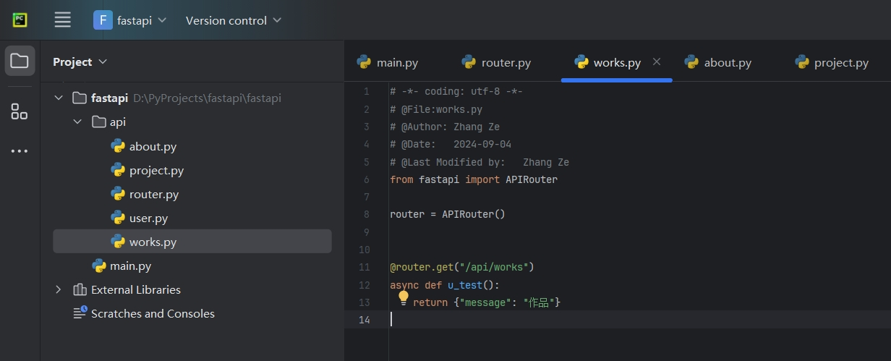

# 目录

## 安装fastapi框架

	pip install fastapi
## 安装ASGI服务器
	安装完框架，然后需要一个服务器提供运行服务，这里安装**Uvicorn**（FastAPI 官方的出品，默认启用访问日志）
	pip install uvicorn
## 启动命令
### 开发
	一般不做什么大更改的情况，都能直接 刷新reload，开发用！！
	uvicorn main:app --reload
### 生产
	uvicorn main:app --host 0.0.0.0 --port 80
**注意！！**

> 如果您正在使用--reload选项，请记住删除它。
> --reload 选项消耗更多资源，并且更不稳定。
> 它在**开发**期间有很大帮助，但您**不应该**在**生产环境**中使用它。

## 使用APIRouter做路由管理
>通过FastAPI()实例化一个app对象之后，有一个include_router的方法。通过查看include_router的源码后发现，有两种方法，一种self（也就是在本身app这个对象下添加路由），一种是使用router。通过APIRouter实例化一个对象暂且称为api。将api作为app的include_router方法里的(router=api).然后由api管理路由

### 方法一
>main.py中

		app = FastAPI()
	    app.include_router(project.router)
	    app.include_router(about.router)
>about.py中

		from fastapi import APIRouter
		router = APIRouter()
		@router.get("/api/about")
		async def u_test():
		return {"message": "关于"}

### 方法二

>main.py中

	from api.router import api
	app = FastAPI()
	app.include_router(router=api)

>router.py中

	from fastapi import APIRouter
	from api import user
	api = APIRouter()
	api.include_router(user.router)
	api.include_router(works.router)
	__all__ = ['api']
>works.py中

	from fastapi import APIRouter
	router = APIRouter()
	@router.get("/api/works")
	async def u_test():
	return {"message": "作品"}

